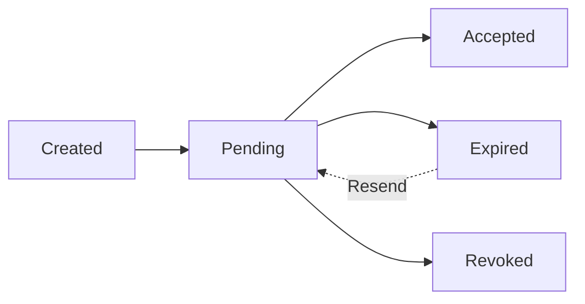

## Overview

Team Invitations allow workspace Admins to invite new users via email. Invitations include a secure token and expire after 48 hours.

<Note>
  **Distinct from Event Invitations**: These are workspace team invitations (`team_invitations`), not event RSVPs (`invitations`). They have different prefixes: `tinv_` vs `inv_`.
</Note>

## The Team Invitation Object

Team invitations are identified by a unique public ID with the prefix `tinv_`.

<ResponseField name="id" type="integer" required>
  Internal database ID
</ResponseField>

<ResponseField name="public_id" type="string" required>
  Public identifier with `tinv_` prefix (e.g., `tinv_abc123xyz`)
</ResponseField>

<ResponseField name="email" type="string" required>
  Email address of the invitee
</ResponseField>

<ResponseField name="account_id" type="integer" required>
  ID of the workspace account
</ResponseField>

<ResponseField name="role" type="enum" required>
  Role the user will have upon acceptance. Options:
  - `member` - Standard user (default)
  - `admin` - Administrative access
</ResponseField>

<ResponseField name="token" type="string" required>
  Secure random token used for invitation acceptance (auto-generated)
</ResponseField>

<ResponseField name="expires_at" type="timestamp" required>
  Expiration timestamp (48 hours from creation)
</ResponseField>

<ResponseField name="created_at" type="timestamp">
  When the invitation was sent
</ResponseField>

<ResponseField name="updated_at" type="timestamp">
  Last modification timestamp (updated when resent)
</ResponseField>

---

## Create Invitation

<Card title="POST /team_invitations" icon="envelope">
  Invite a new member to the workspace. Sends invitation email and creates in-app notification for existing users.
</Card>

### Request Body

<ParamField body="team_invitation[email]" type="string" required>
  Email address of the person to invite. Must be a valid email format.
</ParamField>

<ParamField body="team_invitation[role]" type="enum">
  Role to assign upon acceptance. Options: `member` (default) or `admin`
</ParamField>

### Validations

<ResponseField name="Email Format" type="validation">
  Must match standard email format (RFC 5322)
</ResponseField>

<ResponseField name="Already Invited" type="validation">
  Cannot send duplicate invitations to the same email for the same account
</ResponseField>

<ResponseField name="Already Member" type="validation">
  Cannot invite someone who is already a member of the workspace
</ResponseField>

### Seat Limit Enforcement

<Note>
  **Seat Management**: Invitations count toward the workspace seat limit. Formula:
  ```
  seats_used = memberships.count + team_invitations.count
  ```
</Note>

If the seat limit is reached:

```json
{
  "error": "Seat limit reached (5). Upgrade required."
}
```

### Behavior on Creation

1. **Token Generation**: Secure random token is auto-generated via `has_secure_token`
2. **Expiration Set**: `expires_at` is set to 48 hours from now
3. **Email Sent**: Invitation email delivered via `TeamInvitationMailer.with(invitation: @invitation).invite.deliver_later`
4. **In-App Notification**: If the email matches an existing user, they receive a global notification via `TeamNotifier::InvitationReceived`

### Response

```json
{
  "id": 28,
  "public_id": "tinv_xk7j2m9p",
  "email": "newuser@example.com",
  "account_id": 7,
  "role": "member",
  "token": "AbCdEfGhIjKlMnOpQrStUv",
  "expires_at": "2026-03-05T10:30:00Z",
  "created_at": "2026-03-03T10:30:00Z",
  "updated_at": "2026-03-03T10:30:00Z"
}
```

### Example Request

```bash
curl -X POST https://api.trellixe.com/team_invitations \
  -H "Content-Type: application/json" \
  -d '{
    "team_invitation": {
      "email": "newuser@example.com",
      "role": "member"
    }
  }'
```

---

## Resend Invitation

<Card title="POST /team_invitations/:id/resend" icon="paper-plane">
  Resend an invitation email and extend the expiration time.
</Card>

### Path Parameters

<ParamField path="id" type="string" required>
  Public ID of the invitation (e.g., `tinv_xk7j2m9p`)
</ParamField>

### Rate Limiting

<Note>
  **5-Minute Cooldown**: Invitations can only be resent once every 5 minutes to prevent spam.
</Note>

If resent too soon:

```json
{
  "error": "Please wait 5 minutes before resending."
}
```

### Behavior

When resent:
1. `expires_at` is extended to 48 hours from now
2. `updated_at` timestamp is refreshed
3. Invitation email is delivered again

### Response

```json
{
  "id": 28,
  "public_id": "tinv_xk7j2m9p",
  "email": "newuser@example.com",
  "expires_at": "2026-03-05T15:45:00Z",
  "updated_at": "2026-03-03T15:45:00Z"
}
```

### Example Request

```bash
curl -X POST https://api.trellixe.com/team_invitations/tinv_xk7j2m9p/resend
```

---

## Revoke Invitation

<Card title="DELETE /team_invitations/:id" icon="ban">
  Cancel a pending invitation before it's accepted.
</Card>

### Path Parameters

<ParamField path="id" type="string" required>
  Public ID of the invitation to revoke
</ParamField>

### Behavior

- Invitation is permanently deleted
- The invitation token becomes invalid
- Frees up one seat in the workspace
- No notification is sent to the invitee

### Response

```json
{
  "message": "Invitation revoked."
}
```

### Example Request

```bash
curl -X DELETE https://api.trellixe.com/team_invitations/tinv_xk7j2m9p
```

---

## Accept Invitation

<Card title="PATCH /team_invitation_acceptance" icon="check">
  Accept a team invitation using the token from the email.
</Card>

### Query Parameters

<ParamField query="token" type="string" required>
  Secure token from the invitation email
</ParamField>

### Validation

The system checks:
1. Token exists and matches an invitation
2. Invitation has not expired (`expires_at > Time.current`)
3. User is not already a member of the workspace

### Behavior on Acceptance

1. **Membership Created**: A new membership record is created with the role specified in the invitation
2. **Invitation Deleted**: The invitation is removed from the database
3. **Context Switch**: User's session switches to the new workspace
4. **Seat Released**: Accepting an invitation converts it from a pending invite to an active membership

### Expiration Handling

If the invitation has expired:

```json
{
  "error": "This invitation has expired. Please request a new one."
}
```

### Response

```json
{
  "membership": {
    "id": 45,
    "public_id": "mem_newmember",
    "user_id": 89,
    "account_id": 7,
    "role": "member",
    "created_at": "2026-03-03T16:20:00Z"
  },
  "account": {
    "id": 7,
    "public_id": "acct_workspace",
    "name": "Acme Corp"
  }
}
```

### Example Request

```bash
curl -X PATCH https://api.trellixe.com/team_invitation_acceptance?token=AbCdEfGhIjKlMnOpQrStUv
```

---

## Invitation Lifecycle



### States

<Card title="Pending" icon="clock">
  Invitation sent, awaiting acceptance. Valid for 48 hours.
</Card>

<Card title="Accepted" icon="circle-check">
  User accepted and membership created. Invitation is deleted.
</Card>

<Card title="Expired" icon="hourglass-end">
  48 hours passed without acceptance. Can be resent to create new expiration.
</Card>

<Card title="Revoked" icon="circle-xmark">
  Admin canceled the invitation. Permanently deleted.
</Card>

---

## Security Features

### Token Security

<ResponseField name="has_secure_token" type="feature">
  Rails generates cryptographically secure random tokens using `SecureRandom.base58(24)`
</ResponseField>

<ResponseField name="Unique Index" type="constraint">
  Database enforces uniqueness on the token column
</ResponseField>

### Time-Based Expiration

```ruby
def expired?
  expires_at < Time.current
end
```

Invitations automatically expire 48 hours after creation or last resend.

### Email Case Normalization

Emails are validated against `URI::MailTo::EMAIL_REGEXP` and checked case-insensitively:

```ruby
validates :email, uniqueness: { scope: :account_id }
validate :email_not_already_member # checks users.exists?(email: email)
```

---

## Database Constraints

### Schema Details

```sql
CREATE TABLE team_invitations (
  id BIGSERIAL PRIMARY KEY,
  email VARCHAR NOT NULL,
  account_id BIGINT NOT NULL REFERENCES accounts(id),
  role VARCHAR DEFAULT 'member' NOT NULL,
  token VARCHAR NOT NULL,
  public_id VARCHAR UNIQUE,
  expires_at TIMESTAMP NOT NULL,
  created_at TIMESTAMP NOT NULL,
  updated_at TIMESTAMP NOT NULL,
  
  UNIQUE(account_id, email),
  UNIQUE(token)
);
```

### Cascade Behavior

Invitations are automatically deleted when:
- The account is deleted (`dependent: :destroy`)
- The invitation is accepted (manual deletion)
- The invitation is revoked (manual deletion)

---

## Error Responses

### Validation Errors

```json
{
  "errors": {
    "email": [
      "has already been invited"
    ]
  }
}
```

```json
{
  "errors": {
    "email": [
      "is already a member of this workspace"
    ]
  }
}
```

### Business Logic Errors

**Seat limit reached:**
```json
{
  "error": "Seat limit reached (5). Upgrade required."
}
```

**Rate limit for resend:**
```json
{
  "error": "Please wait 5 minutes before resending."
}
```

**Expired invitation:**
```json
{
  "error": "This invitation has expired. Please request a new one."
}
```
