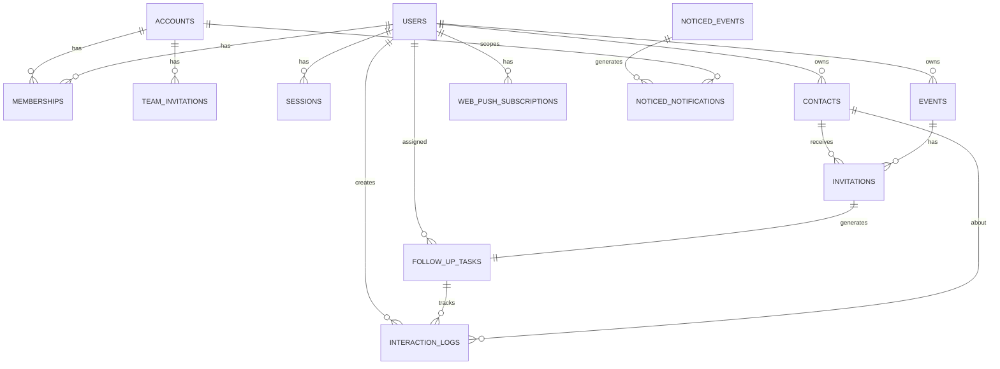

## Overview

Trellixe uses a multi-database architecture:
- **Primary Database**: PostgreSQL for core application data
- **Queue Database**: SQLite3 for Solid Queue job processing
- **Cable Database**: SQLite3 for Action Cable connections
- **Cache Database**: SQLite3 for Solid Cache storage

This document focuses on the primary PostgreSQL database schema.

## Core Tables

### Accounts

Accounts represent workspaces in Trellixe. Each account can have multiple users through memberships.

```sql
CREATE TABLE accounts (
  id BIGSERIAL PRIMARY KEY,
  name VARCHAR DEFAULT 'Personal Workspace' NOT NULL,
  seat_limit INTEGER DEFAULT 5 NOT NULL,
  public_id VARCHAR UNIQUE,
  created_at TIMESTAMP NOT NULL,
  updated_at TIMESTAMP NOT NULL
);
```

<Note>
  The `seat_limit` controls how many users can be members of an account. Default is 5 seats.
</Note>

### Users

User accounts with authentication and profile information.

```sql
CREATE TABLE users (
  id BIGSERIAL PRIMARY KEY,
  email VARCHAR NOT NULL UNIQUE,
  password_digest VARCHAR NOT NULL,
  verified BOOLEAN DEFAULT false NOT NULL,
  provider VARCHAR,
  uid VARCHAR,
  name VARCHAR,
  time_zone VARCHAR,
  public_id VARCHAR UNIQUE,
  created_at TIMESTAMP NOT NULL,
  updated_at TIMESTAMP NOT NULL
);
```

**Key Fields:**
- `email` - Unique email address for authentication
- `password_digest` - Encrypted password using bcrypt
- `verified` - Email verification status
- `provider` / `uid` - OAuth provider integration
- `time_zone` - User's preferred timezone

<Warning>
  Users are linked to accounts through the `memberships` table, not directly. This enables multi-workspace support.
</Warning>

### Memberships

Join table connecting users to accounts with role-based access.

```sql
CREATE TABLE memberships (
  id BIGSERIAL PRIMARY KEY,
  user_id BIGINT NOT NULL REFERENCES users(id),
  account_id BIGINT NOT NULL REFERENCES accounts(id),
  role VARCHAR DEFAULT 'member' NOT NULL,
  public_id VARCHAR UNIQUE,
  created_at TIMESTAMP NOT NULL,
  updated_at TIMESTAMP NOT NULL,
  UNIQUE(user_id, account_id)
);
```

**Roles:**
- `member` - Standard user access (default)
- `admin` - Administrative privileges

### Sessions

Active user sessions for authentication.

```sql
CREATE TABLE sessions (
  id BIGSERIAL PRIMARY KEY,
  user_id BIGINT NOT NULL REFERENCES users(id),
  user_agent VARCHAR,
  ip_address VARCHAR,
  sudo_at TIMESTAMP NOT NULL,
  created_at TIMESTAMP NOT NULL,
  updated_at TIMESTAMP NOT NULL
);
```

## CRM Tables

### Contacts

Contacts in the networking CRM. Uses polymorphic association for future team ownership.

```sql
CREATE TABLE contacts (
  id BIGSERIAL PRIMARY KEY,
  owner_type VARCHAR NOT NULL,
  owner_id BIGINT NOT NULL,
  first_name VARCHAR,
  last_name VARCHAR,
  email VARCHAR,
  phone_number VARCHAR,
  how_we_met TEXT,
  creator_id BIGINT,
  created_at TIMESTAMP NOT NULL,
  updated_at TIMESTAMP NOT NULL
);
```

**Owner Association:**
- In MVP, `owner_type` is always 'User'
- `owner_id` references the user who owns this contact
- `creator_id` tracks who created the contact

### Events

Networking events and meetings.

```sql
CREATE TABLE events (
  id BIGSERIAL PRIMARY KEY,
  owner_type VARCHAR NOT NULL,
  owner_id BIGINT NOT NULL,
  name VARCHAR NOT NULL,
  starts_at TIMESTAMP NOT NULL,
  duration_in_minutes INTEGER NOT NULL,
  created_at TIMESTAMP NOT NULL,
  updated_at TIMESTAMP NOT NULL
);
```

**Key Fields:**
- `name` - Event title
- `starts_at` - Event start date/time
- `duration_in_minutes` - Event length

### Invitations

Links contacts to events with RSVP tracking.

```sql
CREATE TABLE invitations (
  id BIGSERIAL PRIMARY KEY,
  contact_id BIGINT NOT NULL REFERENCES contacts(id),
  event_id BIGINT NOT NULL REFERENCES events(id),
  status INTEGER DEFAULT 0 NOT NULL,
  notes TEXT,
  created_at TIMESTAMP NOT NULL,
  updated_at TIMESTAMP NOT NULL,
  UNIQUE(contact_id, event_id)
);
```

**Status Enum:**
- `0` - Pending
- `1` - Accepted
- `2` - Declined
- `3` - Maybe

<Note>
  Each contact can only be invited once per event (enforced by unique index).
</Note>

### Follow Up Tasks

Tasks for following up with contacts after events.

```sql
CREATE TABLE follow_up_tasks (
  id BIGSERIAL PRIMARY KEY,
  invitation_id BIGINT NOT NULL REFERENCES invitations(id) UNIQUE,
  user_id BIGINT NOT NULL REFERENCES users(id),
  due_at TIMESTAMP NOT NULL,
  completed_at TIMESTAMP,
  created_at TIMESTAMP NOT NULL,
  updated_at TIMESTAMP NOT NULL
);
```

**Key Fields:**
- `invitation_id` - Links to specific event invitation (one task per invitation)
- `due_at` - When the follow-up is due
- `completed_at` - Completion timestamp (NULL if incomplete)

### Interaction Logs

Record of all interactions with contacts.

```sql
CREATE TABLE interaction_logs (
  id BIGSERIAL PRIMARY KEY,
  contact_id BIGINT NOT NULL REFERENCES contacts(id),
  user_id BIGINT NOT NULL REFERENCES users(id),
  follow_up_task_id BIGINT NOT NULL REFERENCES follow_up_tasks(id),
  note TEXT NOT NULL,
  created_at TIMESTAMP NOT NULL,
  updated_at TIMESTAMP NOT NULL
);
```

## Team Management

### Team Invitations

Invitations to join an account workspace.

```sql
CREATE TABLE team_invitations (
  id BIGSERIAL PRIMARY KEY,
  email VARCHAR NOT NULL,
  account_id BIGINT NOT NULL REFERENCES accounts(id),
  role VARCHAR DEFAULT 'member' NOT NULL,
  token VARCHAR NOT NULL UNIQUE,
  public_id VARCHAR UNIQUE,
  expires_at TIMESTAMP NOT NULL,
  created_at TIMESTAMP NOT NULL,
  updated_at TIMESTAMP NOT NULL,
  UNIQUE(account_id, email)
);
```

**Key Fields:**
- `token` - Unique invitation token
- `expires_at` - Invitation expiration timestamp
- `role` - Role the user will receive upon acceptance

## Notification System

### Noticed Events

Notification events from the Noticed gem.

```sql
CREATE TABLE noticed_events (
  id BIGSERIAL PRIMARY KEY,
  type VARCHAR,
  record_type VARCHAR,
  record_id BIGINT,
  params JSONB,
  created_at TIMESTAMP NOT NULL,
  updated_at TIMESTAMP NOT NULL
);
```

### Noticed Notifications

Individual notification deliveries.

```sql
CREATE TABLE noticed_notifications (
  id BIGSERIAL PRIMARY KEY,
  type VARCHAR,
  event_id BIGINT NOT NULL REFERENCES noticed_events(id),
  recipient_type VARCHAR NOT NULL,
  recipient_id BIGINT NOT NULL,
  account_id BIGINT REFERENCES accounts(id),
  public_id VARCHAR UNIQUE,
  read_at TIMESTAMP,
  seen_at TIMESTAMP,
  created_at TIMESTAMP NOT NULL,
  updated_at TIMESTAMP NOT NULL
);
```

**Key Fields:**
- `read_at` - When notification was read
- `seen_at` - When notification was seen (viewed but not necessarily read)

### Web Push Subscriptions

Web push notification subscriptions.

```sql
CREATE TABLE web_push_subscriptions (
  id BIGSERIAL PRIMARY KEY,
  user_id BIGINT NOT NULL REFERENCES users(id),
  endpoint VARCHAR,
  p256dh VARCHAR,
  auth VARCHAR,
  created_at TIMESTAMP NOT NULL,
  updated_at TIMESTAMP NOT NULL
);
```

## Entity Relationship Diagram



## Database Migrations

Migrations are located in `db/migrate/` and are run sequentially. Key migration files:

<CodeGroup>

```ruby db/migrate/20251021085039_create_accounts_migration.rb
class CreateAccountsMigration < ActiveRecord::Migration[8.0]
  def change
    create_table :accounts
  end
end
```

```ruby db/migrate/20251021085040_create_users.rb
class CreateUsers < ActiveRecord::Migration[8.0]
  def change
    create_table :users do |t|
      t.string :email, null: false, index: { unique: true }
      t.string :password_digest, null: false
      t.boolean :verified, null: false, default: false
      t.string :provider
      t.string :uid
      t.references :account, null: false, foreign_key: true
      t.timestamps
    end
  end
end
```

```ruby db/migrate/20260208164508_setup_trellixe_teams.rb
class SetupTrellixeTeams < ActiveRecord::Migration[8.0]
  def change
    # Update Accounts (The Workspace)
    add_column :accounts, :name, :string, null: false, default: "Personal Workspace"
    add_column :accounts, :seat_limit, :integer, default: 5, null: false
    add_column :accounts, :public_id, :string
    add_index :accounts, :public_id, unique: true

    # Update Users
    add_column :users, :public_id, :string
    add_index :users, :public_id, unique: true
    remove_column :users, :account_id, :integer

    # Create Memberships (The Link)
    create_table :memberships do |t|
      t.references :user, null: false, foreign_key: true
      t.references :account, null: false, foreign_key: true
      t.string :role, default: "member", null: false
      t.string :public_id
      t.timestamps
    end
    add_index :memberships, [:user_id, :account_id], unique: true
    add_index :memberships, :public_id, unique: true
  end
end
```

</CodeGroup>

## Running Migrations

### Development

```bash
# Run all pending migrations
bin/rails db:migrate

# Rollback last migration
bin/rails db:rollback

# Rollback multiple migrations
bin/rails db:rollback STEP=3

# Check migration status
bin/rails db:migrate:status
```

### Production

```bash
# Run migrations in production
RAILS_ENV=production bin/rails db:migrate
```

<Warning>
  Always backup your production database before running migrations.
</Warning>

## Database Maintenance

### Seeding Data

```bash
# Load seed data
bin/rails db:seed

# Reset database (drop, create, migrate, seed)
bin/rails db:reset
```

### Database Console

```bash
# PostgreSQL console
bin/rails dbconsole

# Or directly with psql
psql trellixe_development
```

## Multi-Database Configuration

<Tabs>
  <Tab title="Development">
    ```yaml config/database.yml
    development:
      primary:
        adapter: postgresql
        database: trellixe_development
        pool: 5
      queue:
        adapter: sqlite3
        database: storage/trellixe_development_queue.sqlite3
        migrations_paths: db/queue_migrate
      cable:
        adapter: sqlite3
        database: storage/trellixe_development_cable.sqlite3
        migrations_paths: db/cable_migrate
      cache:
        adapter: sqlite3
        database: storage/trellixe_development_cache.sqlite3
        migrations_paths: db/cache_migrate
    ```
  </Tab>
  
  <Tab title="Test">
    ```yaml config/database.yml
    test:
      adapter: postgresql
      database: trellixe_test
      pool: 5
    ```
  </Tab>
  
  <Tab title="Production">
    ```yaml config/database.yml
    production:
      primary:
        adapter: postgresql
        database: trellixe_production
        username: trellixe
        password: <%= ENV["trellixe_DATABASE_PASSWORD"] %>
      cache:
        adapter: postgresql
        database: trellixe_production_cache
        migrations_paths: db/cache_migrate
      queue:
        adapter: postgresql
        database: trellixe_production_queue
        migrations_paths: db/queue_migrate
      cable:
        adapter: postgresql
        database: trellixe_production_cable
        migrations_paths: db/cable_migrate
    ```
  </Tab>
</Tabs>

## Best Practices

<CardGroup cols={2}>
  <Card title="Use Foreign Keys" icon="link">
    Always define foreign key constraints to maintain referential integrity.
  </Card>
  
  <Card title="Add Indexes" icon="bolt">
    Index foreign keys and frequently queried columns for better performance.
  </Card>
  
  <Card title="Use NOT NULL" icon="shield">
    Explicitly set NOT NULL constraints where appropriate to prevent data issues.
  </Card>
  
  <Card title="Unique Constraints" icon="fingerprint">
    Use unique indexes to enforce business rules at the database level.
  </Card>
</CardGroup>