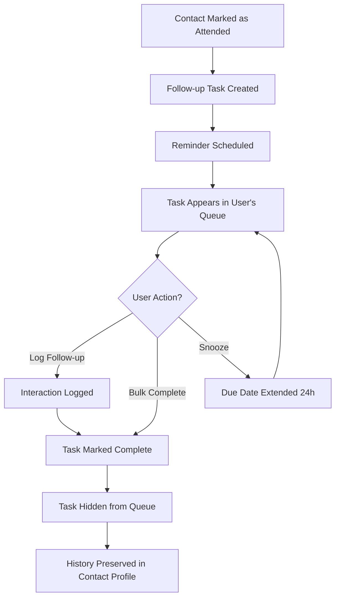

Trillixe's follow-up automation system ensures no networking opportunity falls through the cracks. When you mark event attendees, the system automatically creates follow-up tasks assigned to your team members.

## How Follow-up Tasks Work

Follow-up tasks are automatically created when you mark a contact as "Attended" for an event:

<Steps>
  <Step title="Mark Attendance">
    After an event, navigate to the event detail page and mark which contacts actually attended using the "Mark Attended" button or bulk actions.
  </Step>
  
  <Step title="Task Creation">
    For each attendee, Trellixe automatically creates a follow-up task assigned to a team member. The task includes:
    - Link to the contact's profile
    - Reference to the event they attended
    - Due date for the follow-up
    - Context about how you met and event notes
  </Step>
  
  <Step title="Reminder Scheduling">
    The system schedules an automatic reminder notification to be sent when the task becomes due, ensuring team members don't forget to follow up.
  </Step>
</Steps>

<Note>
Follow-up tasks are only created when marking someone as "Attended." Contacts with status "Invited" do not generate tasks, as you typically only follow up with people you actually met.
</Note>

## Viewing Follow-up Tasks

Access your personal follow-up queue from the "Follow-ups" page in your navigation menu.

### Task List Display

The follow-up tasks page shows:

- Total count of pending tasks in the page header
- Table with all incomplete tasks assigned to you
- Each task displays:
  - **Contact** - Name with link to their profile
  - **Event** - Which event this follow-up relates to
  - **Due Date** - When the follow-up is due
  - **Action Button** - Link to log the interaction

### Task Scope

Important filtering rules:
- You only see tasks assigned to you (not other team members' tasks)
- Only incomplete tasks appear (completed tasks are hidden)
- Only tasks for events belonging to your current account are shown
- Tasks are sorted by due date (earliest first)

## Managing Follow-up Tasks

Trillixe provides several ways to manage your follow-up queue:

### Completing a Task

When you follow up with a contact:

<Steps>
  <Step title="Initiate Follow-up">
    Click the "Log Follow-up" button in the task row to open the interaction logging form.
  </Step>
  
  <Step title="View Context">
    The logging form displays helpful context:
    - How you met the contact (from their profile)
    - Notes from the event (if any were added)
    
    Use this context to personalize your outreach.
  </Step>
  
  <Step title="Log the Interaction">
    After your call, email, or message, enter notes about:
    - How the conversation went
    - What was discussed
    - Any next steps or commitments
    - Outcomes or opportunities identified
  </Step>
  
  <Step title="Save and Complete">
    Click "Save Log and Complete Task" to:
    - Save your interaction notes
    - Mark the task as complete
    - Remove it from your pending queue
    - Add the log to the contact's interaction history
  </Step>
</Steps>

<Note>
Completing a follow-up task and logging an interaction happen together in a single transaction. You cannot complete a task without logging what happened.
</Note>

### Bulk Task Actions

Manage multiple tasks at once using bulk operations:

#### Bulk Complete

1. Select multiple tasks using the checkboxes
2. A floating action bar appears showing how many tasks are selected
3. Click "Mark Complete" to complete all selected tasks
4. Confirm the action when prompted

<Warning>
Bulk completing tasks will mark them as complete WITHOUT requiring interaction notes. Use this only for tasks you've already handled but forgot to log, or for tasks that no longer need follow-up. For normal workflow, use the individual "Log Follow-up" button to capture valuable interaction details.
</Warning>

#### Snooze Tasks

If you need more time to complete a follow-up:

1. Select the tasks you want to delay
2. Click "Snooze 24h" in the action bar
3. The due date for selected tasks shifts forward by 24 hours
4. Tasks remain in your queue but with updated due dates

Use snoozing when:
- You haven't been able to reach the contact yet
- You're waiting for a response before following up again
- The timing isn't right for outreach

### Select All Functionality

Quickly select multiple tasks:

- Click the checkbox in the table header to select all visible tasks
- The action bar updates to show the total count selected
- Click again to deselect all tasks

## Task Assignment

Currently, follow-up tasks are assigned based on your system's configuration. The `user` association on the `FollowUpTask` model determines who receives each task.

<Note>
Task assignment logic is configured at the application level. Contact your administrator if you need to modify how tasks are distributed among team members.
</Note>

## Filtering Follow-up Tasks

Use the search form to filter your task list:

- **Filter by event** - Show only follow-ups from a specific event
- **Filter by date range** - See tasks due within a certain timeframe
- **Filter by contact** - Find follow-ups for a specific person

Filtering helps you prioritize when you have many pending tasks.

## Reminder System

Trillixe includes automated reminders:

- When a task is created, a reminder is scheduled for the due date
- Reminders are sent via your configured notification system
- The reminder includes task details and direct links to log the follow-up

<Accordion title="Technical Detail: Reminder Jobs">
Reminders are powered by the `FollowUpReminderJob` background job, which is scheduled using `perform_later` with a `wait_until` parameter set to the task's due date. The job is automatically created when a new follow-up task is saved.
</Accordion>

## Follow-up Task Lifecycle

## Best Practices

<Accordion title="Follow Up Quickly">
Aim to complete follow-ups within 2-3 days of an event while the interaction is fresh in everyone's minds. Research shows timely follow-up significantly increases response rates and relationship development.
</Accordion>

<Accordion title="Write Detailed Notes">
When logging interactions, include:
- Specific topics discussed
- Personal details mentioned (family, hobbies, challenges)
- Commitments you made
- Next steps or opportunities

These notes become invaluable for future interactions and help team members provide continuity if they need to engage with the contact.
</Accordion>

<Accordion title="Use Snooze Strategically">
Don't snooze indefinitely. If you've snoozed a task multiple times, consider:
- Whether this relationship is a priority
- If someone else on your team should handle it
- Whether to mark it complete without follow-up

An overflowing snooze queue reduces the system's effectiveness.
</Accordion>

<Accordion title="Review Before Acting">
Before contacting someone, click through to their contact profile to review:
- Their full interaction history
- All events they've attended
- Previous conversation notes

This context helps you personalize outreach and avoid redundant conversations.
</Accordion>

<Accordion title="Respect Task Ownership">
Follow-up tasks are assigned to specific team members. If you see a task assigned to a colleague in an event view, respect that ownership unless you've coordinated a handoff. This prevents duplicate outreach that can frustrate contacts.
</Accordion>

## Troubleshooting

<Accordion title="Task Not Created After Marking Attended">
If a follow-up task doesn't appear:
- Check that you marked the status as "Attended" (not just "Invited")
- Verify the event belongs to your current account
- Ensure the invitation was saved successfully
- Check with your team administrator about task assignment configuration
</Accordion>

<Accordion title="Cannot See Expected Tasks">
If tasks are missing from your queue:
- Confirm you're looking at the correct account context
- Check if tasks were already completed by you or another team member
- Verify the events belong to your account (not a different workspace)
- Use filtering to ensure you haven't hidden tasks with search criteria
</Accordion>